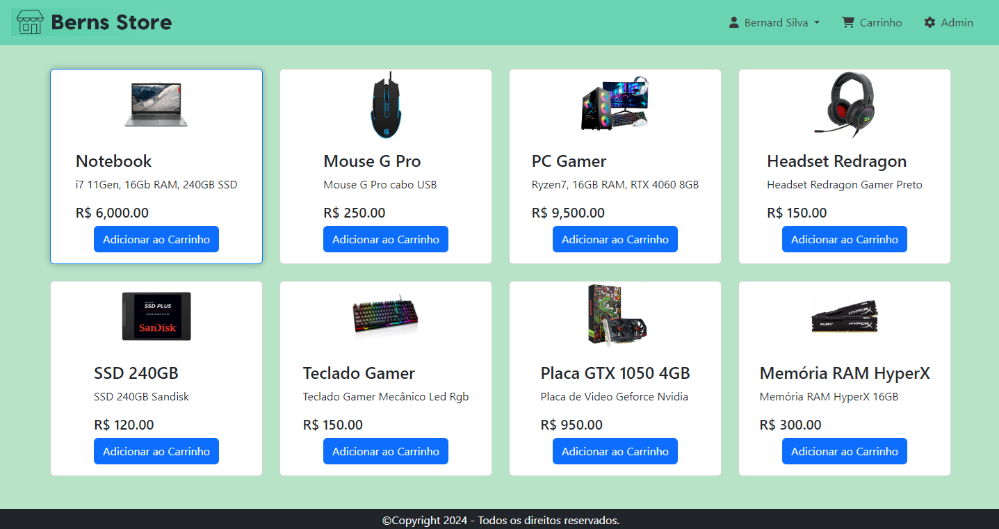

# <center>Ecommerce Berns Store</center>

<p align="center">
   
</p>

<div align="center">

  [Português](#pt) / [English](#en)

</div>


## 📝 Índice <a name = "pt"></a>

- [Sobre](#about_pt)
- [Linguagens e Ferramentas](#frameworks_pt)
- [Aprendizados](#learnings_pt)
- [Como executar localmente?](#running_pt)

## 🎯 Sobre <a name = "about_pt"></a>

- Criado Ecommerce Berns Store de Tecnologia onde é possível se cadastrar, logar, adicionar produtos ao carrinho, finalizar compras, visualizar as compras realizadas. Em perfil de admin é possível listar todos os produtos, editar e adicionar novos produtos, onde ao clicar no logotipo sempre direciona para a home.
- O sistema contempla as seguintes telas:
    - Tela principal com os produtos com opção de entrar em Minha Conta
    - Tela de Login e de Cadastro com validações
    - Perfil para usuário comum:
        - Acesso a pagina principal, ao Carrinho e ao Pedidos Relizados contendo histórico de compras
    - Perfil de admin:
        - Idem ao perfil do usuário comum, porém tem um link para página de Admin onde é possível listar todos os produtos Editar/Excluir ou Adicionar novos produtos.
        - O perfil de admin tem outro tema para sinalizar o ganho de privilégio aos recursos do sistema.

## ⚒ Linguagens e Ferramentas <a name = "frameworks_pt"></a>

- [HTML](https://developer.mozilla.org/pt-BR/docs/Web/HTML)
- [CSS](https://developer.mozilla.org/pt-BR/docs/Web/CSS)
- [Bootstrap](https://getbootstrap.com/)
- [AngularJS](https://angularjs.org/)
- [Node.js](https://nodejs.org/)
- [Express](https://expressjs.com/)
- [Prisma](https://prisma.io/)
- [SQLite](https://www.sqlite.org/)
- [Font Awesome Icon](https://fontawesome.com/search?o=r&m=free)

## 💡 Aprendizados <a name = "learnings_pt"></a>

- Desenvolvimento do Frontend com o AngularJS e Bootstrap
- Desenvolvimento de uma API
- Modelagem de base dados com ORM Prisma
- Static Public do Express para desenvolvimento do frontend em conjunto com o backend (`app.use(express.static('public'))`)
- Biblioteca body-parser que serve como um middleware do backend para analisar as informações do body enviadas do frontend para backend.
- Criado o script seed.js para carga inicial dos dados e recursos para uso do sistema
- Além de instalado o `cors` e `jsonwebtoken`, também foi instalado o `jwt-decode`, onde:
    - Foi copiado o arquivo `index.js` da raiz da `build/esm` no diretório `/public/assets/js/lib/jwt-decode.js`
- Diversas linhas de comandos utilizadas no decorrer do desenvolvimento, [**confira documentação aqui**](.github/docs/COMMAND-LINES.md)

## 🖥️ Como executar localmente? <a name = "running_pt"></a>

Clone o projeto:

```
git clone https://github.com/bernard-silva/ecommerce-berns-store-node-angularjs.git
```

Instala conforme o que estiver declarado no package.json:
```
npm install
```

`Obervação:` criar um arquivo .env na raiz para uso do SQLite como dev:
```
DATABASE_URL="file:./dev.db"
```

Cria o schema para base de dados conforme arquivo .env:
```
npx prisma migrate dev
```

Roda o projeto:
```
npm run dev
```


## English

## 📝 Index <a name = "en"></a>

- [About](#about_en)
- [Languages and Tools](#frameworks_en)
- [Learnings](#learnings_en)
- [How to run locally?](#running_en)

## 🎯 About <a name = "about_en"></a>

- Created Ecommerce Berns Technology Store where it is possible to register, log in, add products to the cart, complete purchases, view purchases made. In the admin profile you can list all products, edit and add new products, where clicking on the logo always takes you to the home page.
- The system includes the following pages:
     - Home Page with products with option to enter in My Account
     - Login and Registration page with validations
     - Profile for common user:
         - Access to the Home Page, Cart and Purchases Made containing purchase history
     - Admin profile:
         - Same as the common user profile, but has a link to the Admin Page where it is possible to list all products, Edit/Delete or Add new products.
         - The admin profile has another theme to signal the increased privilege to system resources.

## ⚒ Languages and Tools <a name = "frameworks_en"></a>

- [HTML](https://developer.mozilla.org/en-US/docs/Web/HTML)
- [CSS](https://developer.mozilla.org/en-US/docs/Web/CSS)
- [Bootstrap](https://getbootstrap.com/)
- [AngularJS](https://angularjs.org/)
- [Node.js](https://nodejs.org/)
- [Express](https://expressjs.com/)
- [Prisma](https://prisma.io/)
- [SQLite](https://www.sqlite.org/)
- [Font Awesome Icon](https://fontawesome.com/search?o=r&m=free)

## 💡 Learnings <a name = "learnings_en"></a>

- Frontend development with AngularJS and Bootstrap
- Development of an API
- Database modeling with ORM Prisma
- Express Static Public for frontend development in conjunction with the backend (`app.use(express.static('public'))`)
- Body-parser library that serves as a backend middleware to parse body information sent from the frontend to the backend.
- Created the seed.js script to initially load data and resources for system
- In addition to installing `cors` and `jsonwebtoken`, `jwt-decode` was also installed, where:
     - The `index.js` file was copied from the `build/esm` root into the `/public/assets/js/lib/jwt-decode.js` directory
- Several command lines used during development, [**check documentation here**](.github/docs/COMMAND-LINES-en-US.md)

## 🖥️ How to run locally? <a name = "running_en"></a>

Clone the project:

```
git clone https://github.com/bernard-silva/ecommerce-berns-store-node-angularjs.git
```

Installs according to what is declared in package.json:
```
npm install
```

`Note:` create a .env file in the root for SQLite use as dev:
```
DATABASE_URL="file:./dev.db"
```

Create the schema for the database according to the .env file:
```
npx prisma migrate dev
```

Run the project:
```
npm run dev
```